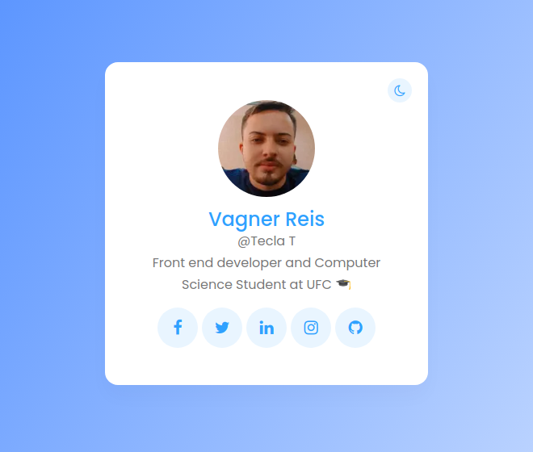
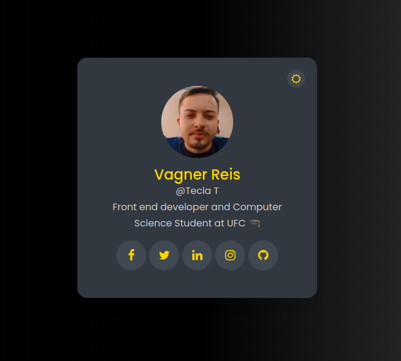

<h1 align="center">
  Findme and feel free to get in touch. :beer:
</h1>

<p align="center">
  <a href="#-projeto">Sobre o Projeto</a> •
  <a href="#-guia-de-instalação-e-execução">Guia de instalação</a> •
  <a href="#-tecnologias">Tecnologias</a> •
  <a href="#-layout">Layout</a>
</p>

<div styles="display: flex;">
    <h1 align="center">
        
    </h1>
    <h1 align="center">
        
    </h1>
<div>

<br>

## 💻 Projeto

Projeto simples para exercitar o modo escuro e o SSR com Next.js

## 📚 Guia de instalação e execução

Clone o projeto e acesse a pasta do mesmo.

```bash
$ git clone https://github.com/vagnereix/findme
$ cd findme
```

Para iniciá-lo, siga os passos abaixo:
```bash
# Instalar as dependências
$ yarn

# Iniciar o projeto
$ yarn dev
```
O app estará disponível no seu browser pelo endereço http://localhost:3000.

## 🚀 Tecnologias

Esse projeto foi desenvolvido com as seguintes tecnologias:

- [Next.js](https://reactjs.org)
- [Axios](https://firebase.google.com/)
- [TypeScript](https://www.typescriptlang.org/)

---

<p align="center">
Feito com :black_heart:&nbsp;e ☕&nbsp;por <a href="https://github.com/vagnereix">Vagner Reis</a>
</p>